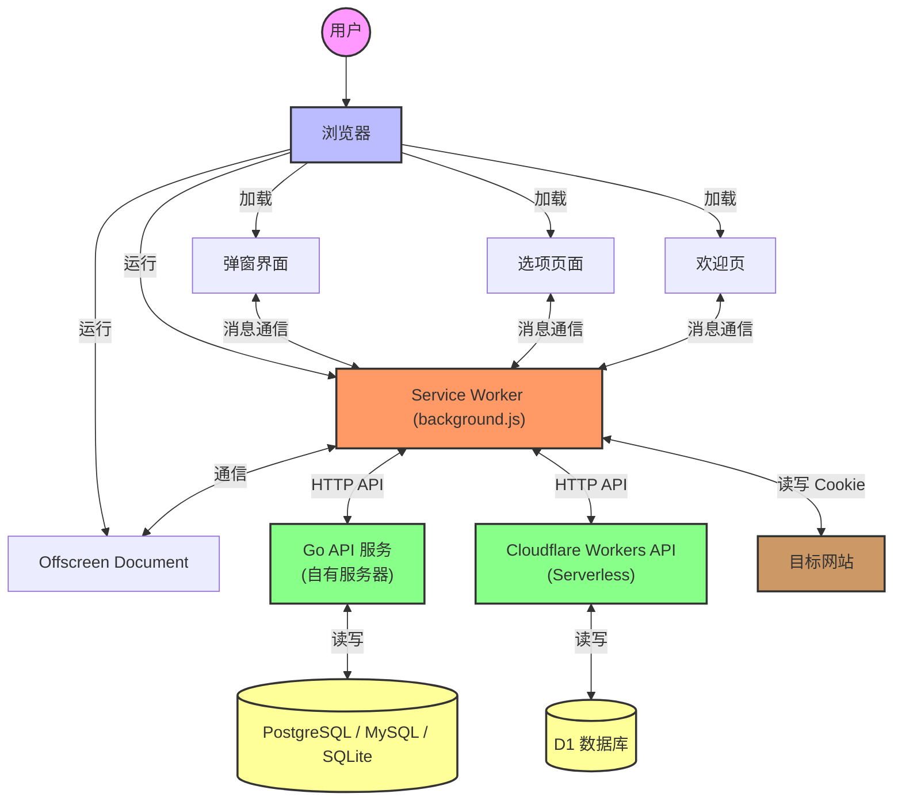
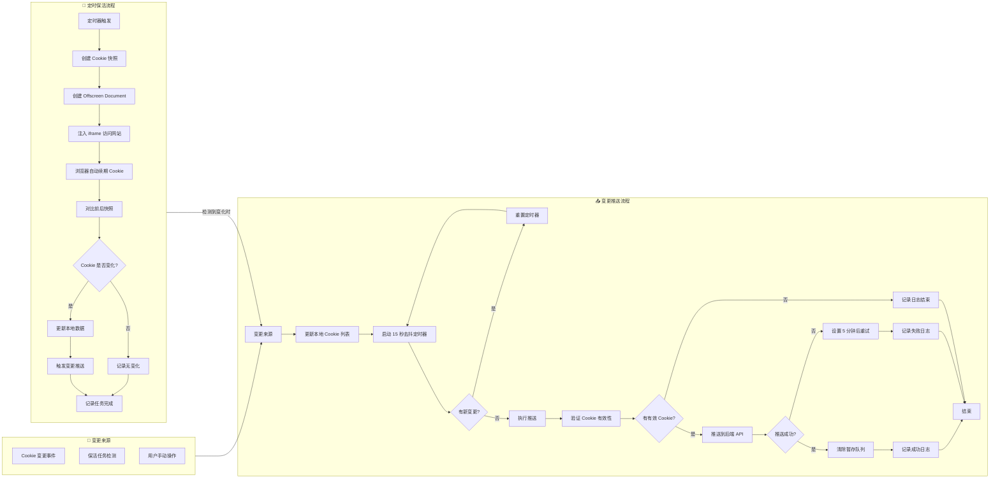

# 🍪 CookiePusher - 通用 Cookie/TOKEN 推送助手

[](README.md)

**CookiePusher** 是一个为开发者和高级用户设计的**单向同步**工具，旨在解决在多个第三方程序或设备间手动同步登录状态的繁琐问题。

它的核心理念是：让您在浏览器中活跃的登录状态（Cookie/Token）能够被实时、自动地推送到一个中心化的 API 服务，从而让您在其他任何需要该登录凭据的地方（如脚本、移动应用），都能获取到最新的、可用的 Cookie。

## ✨ 主要特性

- **🤖 核心同步机制**:
    - **🤫 静默保活**：通过后台定时任务，静默访问目标网站，模拟真实用户活跃，自动刷新即将过期的 Cookie，确保登录状态持久有效。
    - **📡 变更推送**：通过 `chrome.cookies.onChanged` API 监听 Cookie 的精确变化，并将更新后的 Cookie 推送到您的私有后端，实现近乎实时的同步。

- **🔧 便捷的 Cookie 管理**:
    - **🔍 轻松查看**：在插件的 Popup 界面中，方便地查看、搜索当前页面的所有 Cookie。
    - **📝 快速操作**：支持一键复制 Cookie 值、添加备注，以及快速将任何 Cookie 加入到您的同步列表中。

- **🌐 灵活的后端支持**:
    - **🔐 双后端支持**：您可以选择部署在自己的服务器上（Go），或是使用 Cloudflare 提供的 Serverless 服务，灵活度高。
    - **🌍 共享池 (可选)**：API 服务端提供了一个简易的 Cookie 共享池功能，允许您将某些非敏感的 Cookie 共享给团队或社区，方便协作。

- **⚙️ 强大的辅助功能**:
    - **📊 状态统计**：内置统计面板，直观展示每个受控 Cookie 的保活成功率、续期历史和下一次续期时间。
    - **📦 数据备份/恢复**：支持一键导出/导入所有配置和同步列表，迁移设备无忧。
    - **🏃‍♂️ 后台持续运行**：只要您的浏览器开启了“后台运行”模式，即使关闭所有窗口，插件的定时保活任务依然会准时执行。

## 🏗️ 总体架构



### 核心机制详解

插件的自动化能力主要依赖于两个核心机制：**定时保活 (Keep-Alive)** 和 **变更推送 (Change & Push)**。



### 1. ⏳ 静默保活 (Keep-Alive)

这是确保 Cookie “永不过期”的关键。
1.  **定时唤醒**：插件使用 `chrome.alarms` API 创建一个周期性定时器（用户可自定义频率）。
2.  **创建离屏文档**：当定时器触发，后台 Service Worker 会被唤醒，并创建一个 Offscreen Document。这是 Manifest V3 插件在后台执行 DOM 操作（如此处创建 iframe）的唯一方式。
3.  **静默访问**：插件会在这个离屏文档中，为所有需要保活的域名动态创建一系列 `iframe`。通过加载这些 `iframe`，浏览器会向目标域名发起一次真实的、但用户无感的网络请求。
4.  **自动续期**：如果服务器配置正确，这次请求会像正常的用户访问一样，刷新（续期）相关的 Cookie，延长其有效期。
5.  **记录结果**：访问完成后，Service Worker 会对比操作前后的 Cookie 快照，并将续期成功、失败或无变化的状态记录到统计面板中。

### 2. 📤 变更推送 (Change & Push)

这是确保您的后端总能拿到最新 Cookie 的机制。
1.  **监听变更**：插件使用 `chrome.cookies.onChanged` API，这是一个强大的事件监听器，可以捕获浏览器中每一个 Cookie 的增、删、改操作。
2.  **过滤与暂存**：当监听到一个变更时，后台脚本会检查这个 Cookie 是否在您的“同步列表”中。如果是，它会立即将这个变更更新到本地存储中，并将其“暂存”起来。
3.  **去抖处理 (Debounce)**：为了避免因短时间内的大量 Cookie 变化（例如，登录瞬间）而频繁请求 API，插件内置了一个 **15秒** 的去抖定时器。任何在15秒内发生的变更都会被合并到同一个推送任务中。
4.  **执行推送**：15秒暂存窗口结束后，`triggerFullSync` 函数会被调用，将所有已暂存和已验证的最新 Cookie 一次性推送到您配置的 API 端点。

通过这两套机制的协作，CookiePusher 实现了真正意义上的“一次配置，永远在线”。

## ⚠️ 重要：谨慎选择同步目标

为了避免不必要的 API 调用和数据存储开销（尤其在使用 Cloudflare 部署时），请务必**按需、审慎地选择要同步的 Cookie**。

- **🎯 只选择必要的 Cookie**: 将同步列表的范围限制在您真正在其他地方需要的 Cookie 上。
- **📈 避免高频变化的 Cookie**: 某些网站的 Cookie 可能是临时指纹或追踪ID（例如 Bilibili 的 `buvid4`），它们在每次页面加载时都可能变化。将这类 Cookie 加入同步列表，会导致插件进行大量不必要的推送，迅速消耗您的后端资源和免费额度。

> **💡 最佳实践**：在添加一个 Cookie 到同步列表前，先观察它在多次刷新页面后的变化情况。如果它频繁变化且对您的外部应用无用，请不要同步它。


## 🚀 快速开始

### 1. ☁️ 部署后端服务

您可以从以下两种方案中选择一种来部署后端 API：

- **方案 A: Go 后端 (推荐)**
  如果您有自己的服务器或熟悉 Docker，推荐使用此方案。它更稳定，且没有免费额度的后顾之忧。

  #### Docker 部署 (最简单)
  我们强烈推荐使用 Docker Compose 进行部署。它提供了一个灵活的、生产级的启动方式。
  
  **详细部署指南请参考 Go 后端服务的 `README.md` 文件：**

  **[➡️ 查看详细的 Go 后端部署指南](api_service/backend/README.md)**

- **方案 B: Cloudflare Worker 后端**
  如果您没有服务器，希望快速体验，可以选择此方案。
  
  **[➡️ 查看 Cloudflare Worker 部署指南](api_service/cf/README.md)**

### 2. 🧩 构建并加载插件

  **[➡️ 查看插件开发与调试指南](DEVELOPMENT.md)**

1.  **安装依赖**:
    ```bash
    npm install
    ```
2.  **构建插件**:
    ```bash
    npm run build
    ```
    构建产物将位于项目根目录的 `dist` 文件夹下。

3.  **加载插件**:
    - 打开 Chrome/Edge 浏览器的扩展管理页面 (`chrome://extensions` 或 `edge://extensions`)。
    - 启用“开发者模式”。
    - 点击“加载已解压的扩展程序”，选择上一步生成的 `dist` 目录。

### 3. 🔌 配置插件

1.  点击浏览器工具栏中的 CookiePusher 图标，打开 Popup 界面。
2.  进入“设置”页面。
3.  填写您在第一步中部署好的 **API 端点** 和 **Auth Token** (API Key)。
4.  点击“测试连接”，如果成功，您就可以开始使用了！


## ✅ 待办 (TODO)

- [ ] **增强令牌同步**：增加对 `LocalStorage` 和 `SessionStorage` 的监控与同步。
- [ ] **智能频率调整**：根据 Cookie 有效期和变化历史，动态调整保活频率。
- [ ] **用户活动感知**：仅在浏览器活跃时执行高频保活，降低后台资源消耗。

## ✨ 开源贡献

这是一个开源项目，我们欢迎任何形式的贡献，无论是提交 Issue、发起 Pull Request，还是帮助改进文档。

- **GitHub 地址**: [](https://github.com/Drean21/CookiePusher)

## 📜 许可

本项目采用 [MIT](LICENSE) 许可。
