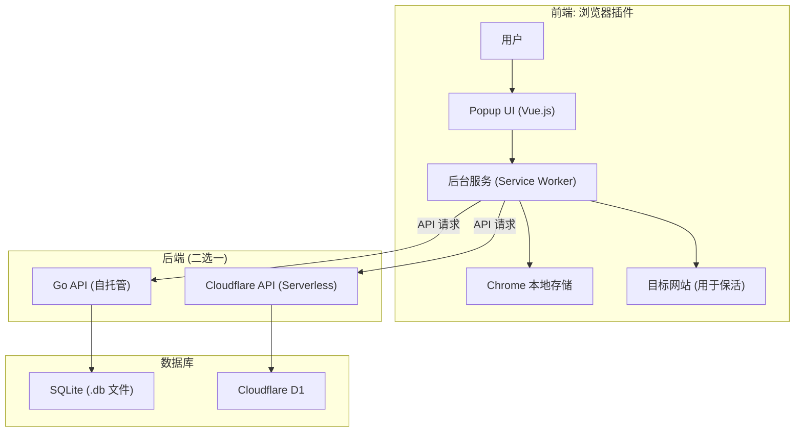

# CookieSyncer - 通用 Cookie/TOKEN 推送助手

[](README.md)

**CookieSyncer** 是一个为重度浏览器用户设计的**单向同步**工具，旨在解决在多个第三方程序或设备间手动同步登录状态的繁琐问题。

它的核心理念是：让您在浏览器中活跃的登录状态（Cookie/Token）能够被实时、自动地推送到一个中心化的 API 服务，从而让您在其他任何需要该登录凭据的地方，都能获取到最新的、可用的 Cookie。

**如果您是一位需要频繁在浏览器和外部程序（如脚本、移动应用）之间同步登录状态的开发者、测试人员或高级用户，这个项目将为您带来极大的便利。**

## ✨ 主要特性

- **🚀 单向推送**: 核心是“推送”。监听浏览器中指定 Cookie 的变化，并自动推送到您的私有后端。
- **🤫 静默保活**: 通过后台静默访问目标网站，自动刷新即将过期的 Cookie，确保登录状态持久有效。
- **🔐 双后端支持**:
    - **[Go (自托管)](api_service/backend/README.md)**: 稳定、高效，推荐拥有自己服务器的用户使用。
    - **[Cloudflare (Serverless)](api_service/cf/README.md)**: 方便快捷，可一键部署，适合没有服务器的用户（**注意有免费额度限制**）。
- **💻 多设备支持**: 轻松在不同的浏览器、设备或虚拟机之间同步您的登录凭据。
- **📊 状态统计**: 内置统计面板，直观展示每个 Cookie 的保活成功率和历史记录。
- **📦 数据备份/恢复**: 支持一键导出/导入所有配置和同步列表。

## ⚠️ 重要：谨慎选择同步目标

为了避免不必要的 API 调用和数据存储开销（尤其在使用 Cloudflare 部署时），请务必**按需、审慎地选择要同步的 Cookie**。

- **只选择必要的 Cookie**: 将同步列表的范围限制在您真正在其他地方需要的 Cookie 上。
- **避免高频变化的 Cookie**: 某些网站的 Cookie 可能是临时指纹或追踪ID（例如 Bilibili 的 `buvid4`），它们在每次页面加载时都可能变化。将这类 Cookie 加入同步列表，会导致插件进行大量不必要的推送，迅速消耗您的后端资源和免费额度。

> **最佳实践**：在添加一个 Cookie 到同步列表前，先观察它在多次刷新页面后的变化情况。如果它频繁变化且对您的外部应用无用，请不要同步它。

## 🏛️ 项目架构

CookieSyncer 由两部分组成：一个浏览器插件（前端）和一个 API 服务（后端）。



## 💡 核心架构：混合式存储 (Hybrid Storage)

为了在数据结构化和读取性能之间取得最佳平衡，本项目采用了一种精巧的**混合式存储**设计。

- **`cookies` 表 (规范化存储)**: 每一条 Cookie 都被解析并存储为独立的一行。这种规范化的结构非常适合需要复杂查询和数据完整性的场景，例如“共享池”功能。

- **`users.cookies_json` 字段 (缓存存储)**: 在每次用户推送数据时，系统会将该用户**所有 Cookie 的完整列表**序列化成一个 JSON 字符串，并将其作为一个“缓存快照”存储在 `users` 表的 `cookies_json` 字段中，同时更新 `last_synced_at` 时间戳。

**这种设计的优势在于**：对于最常见的“获取用户自身全部/部分 Cookie”的请求，API 无需对庞大的 `cookies` 表进行查询，而是可以直接从 `users` 表中读取这个预先生成好的 JSON 缓存。这极大地减少了数据库 I/O，显著提升了读取性能。


## 🚀 快速开始

### 1. 部署后端服务

您需要从以下两种方案中选择一种来部署后端 API：

- **方案 A: Go 后端 (推荐)**
  如果您有自己的服务器，推荐使用此方案。它更稳定，且没有免费额度的后顾之忧。
  
  **[➡️ 查看 Go 后端部署指南](api_service/backend/README.md)**

- **方案 B: Cloudflare Worker 后端**
  如果您没有服务器，希望快速体验，可以选择此方案。
  
  **[➡️ 查看 Cloudflare Worker 部署指南](api_service/cf/README.md)**

### 2. 构建并加载插件

1.  **安装依赖**:
    ```bash
    npm install
    ```
2.  **构建插件**:
    ```bash
    npm run build
    ```
    构建产物将位于项目根目录的 `dist` 文件夹下。

3.  **加载插件**:
    - 打开 Chrome/Edge 浏览器的扩展管理页面 (`chrome://extensions` 或 `edge://extensions`)。
    - 启用“开发者模式”。
    - 点击“加载已解压的扩展程序”，选择上一步生成的 `dist` 目录。

### 3. 配置插件

1.  点击浏览器工具栏中的 CookieSyncer 图标，打开 Popup 界面。
2.  进入“设置”页面。
3.  填写您在第一步中部署好的 **API 端点** 和 **Auth Token** (API Key)。
4.  点击“测试连接”，如果成功，您就可以开始使用了！

## 📜 许可

本项目采用 [MIT](LICENSE) 许可。
