# CookiePusher - 通用 Cookie/TOKEN 推送助手

[](README.md)

**CookiePusher** 是一个为开发者和高级用户设计的**单向同步**工具，旨在解决在多个第三方程序或设备间手动同步登录状态的繁琐问题。

它的核心理念是：让您在浏览器中活跃的登录状态（Cookie/Token）能够被实时、自动地推送到一个中心化的 API 服务，从而让您在其他任何需要该登录凭据的地方（如脚本、移动应用），都能获取到最新的、可用的 Cookie。

## ✨ 主要特性

- **🤖 核心同步机制**:
    - **🤫 静默保活**：通过后台定时任务，静默访问目标网站的 iframe，以模拟真实用户活跃，从而自动刷新即将过期的 Cookie，确保登录状态持久有效。
    - **🚀 变更推送**：通过 `chrome.cookies.onChanged` API 监听 Cookie 的精确变化，并将更新后的 Cookie 推送到您的私有后端，实现近乎实时的同步。

- **🔧 便捷的 Cookie 管理**:
    - 在插件的 Popup 界面中，您可以方便地查看、搜索当前页面的所有 Cookie。
    - 支持一键复制 Cookie 值、添加备注，以及快速将任何 Cookie 加入到您的同步列表中。

- **🌐 双后端与 Cookie 池**:
    - **🔐 双后端支持**：您可以选择部署在自己的服务器上（Go），或是使用 Cloudflare 提供的 Serverless 服务，灵活度高。
    - **🌍 共享池**：API 服务端提供了一个简易的 Cookie 共享池功能，允许您将某些非敏感的 Cookie 共享给团队或社区，方便协作。

- **⚙️ 强大的辅助功能**:
    - **📊 状态统计**：内置统计面板，直观展示每个受控 Cookie 的保活成功率、续期历史和下一次续期时间。
    - **📦 数据备份/恢复**：支持一键导出/导入所有配置和同步列表，迁移设备无忧。
    - **🏃‍♂️ 后台持续运行**：只要您的浏览器开启了“后台运行”模式，即使关闭所有窗口，插件的定时保活任务依然会准时执行。

## 总体架构

```mermaid
graph TD
    User((用户)) --> Browser[浏览器]
    Browser --> |加载| Popup[弹窗界面]
    Browser --> |加载| Options[选项页面]
    Browser --> |加载| Welcome[欢迎页]
    Browser --> |运行| ServiceWorker["Service Worker (background.js)"]
    Browser --> |运行| Offscreen["Offscreen Document"]

    Popup <--> |消息通信| ServiceWorker
    Options <--> |消息通信| ServiceWorker
    Welcome <--> |消息通信| ServiceWorker
    ServiceWorker <--> |通信| Offscreen

    ServiceWorker <--> |HTTP API| GoAPI["Go API 服务<br/>(/api/*)"]
    ServiceWorker <--> |HTTP API| CFAPI["Cloudflare Workers API<br/>(/cf/api/*)"]
    GoAPI <--> |读写| SQLite[(SQLite 数据库)]
    CFAPI <--> |读写| D1[(D1 数据库)]
    
    ServiceWorker <--> |读写 Cookie| TargetWebsite[目标网站]

    style User fill:#f9f,stroke:#333,stroke-width:2px
    style Browser fill:#bbf,stroke:#333,stroke-width:2px
    style ServiceWorker fill:#f96,stroke:#333,stroke-width:2px
    style GoAPI fill:#8f8,stroke:#333,stroke-width:2px
    style CFAPI fill:#8f8,stroke:#333,stroke-width:2px
    style SQLite fill:#ff9,stroke:#333,stroke-width:2px
    style D1 fill:#ff9,stroke:#333,stroke-width:2px
    style TargetWebsite fill:#c96,stroke:#333,stroke-width:2px
```



### 核心机制详解

插件的自动化能力主要依赖于两个核心机制：**定时保活 (Keep-Alive)** 和 **变更推送 (Change & Push)**。

```mermaid
graph LR
    subgraph KeepAlive [定时保活流程]
        KA1[定时器触发] --> KA2[创建 Cookie 快照]
        KA2 --> KA3[创建 Offscreen Document]
        KA3 --> KA4[注入 iframe 访问网站]
        KA4 --> KA5[浏览器自动续期 Cookie]
        KA5 --> KA6[对比前后快照]
        KA6 --> KA7{Cookie 是否变化?}
        KA7 -- 是 --> KA8[更新本地数据]
        KA8 --> KA9[触发变更推送]
        KA7 -- 否 --> KA10[记录无变化]
        KA9 --> KA11
        KA10 --> KA11[记录任务完成]
    end

    subgraph ChangePush [变更推送流程]
        CP1[变更来源] --> CP2[更新本地 Cookie 列表]
        CP2 --> CP3[启动 15 秒去抖定时器]
        CP3 --> CP4{有新变更?}
        CP4 -- 是 --> CP5[重置定时器]
        CP5 --> CP3
        CP4 -- 否 --> CP6[执行推送]
        CP6 --> CP7[验证 Cookie 有效性]
        CP7 --> CP8{有有效 Cookie?}
        CP8 -- 否 --> CP9[记录日志结束]
        CP8 -- 是 --> CP10[推送到后端 API]
        CP10 --> CP11{推送成功?}
        CP11 -- 是 --> CP12[清除暂存队列]
        CP11 -- 否 --> CP13[设置 5 分钟后重试]
        CP12 --> CP14[记录成功日志]
        CP13 --> CP15[记录失败日志]
        CP14 --> CP16[结束]
        CP15 --> CP16
        CP9 --> CP16
    end

    subgraph Sources [变更来源]
        S1[Cookie 变更事件]
        S2[保活任务检测]
        S3[用户手动操作]
    end
    
    Sources --> CP1
    KeepAlive -- "检测到变化时" --> CP1
```



### 1. 静默保活 (Keep-Alive)

这是确保 Cookie “永不过期”的关键。
1.  **定时唤醒**：插件使用 `chrome.alarms` API 创建一个周期性定时器（用户可自定义频率）。
2.  **创建离屏文档**：当定时器触发，后台 Service Worker 会被唤醒，并创建一个 Offscreen Document。这是 Manifest V3 插件在后台执行 DOM 操作（如此处创建 iframe）的唯一方式。
3.  **静默访问**：插件会在这个离屏文档中，为所有需要保活的域名动态创建一系列 `iframe`。通过加载这些 `iframe`，浏览器会向目标域名发起一次真实的、但用户无感的网络请求。
4.  **自动续期**：如果服务器配置正确，这次请求会像正常的用户访问一样，刷新（续期）相关的 Cookie，延长其有效期。
5.  **记录结果**：访问完成后，Service Worker 会对比操作前后的 Cookie 快照，并将续期成功、失败或无变化的状态记录到统计面板中。

### 2. 变更推送 (Change & Push)

这是确保您的后端总能拿到最新 Cookie 的机制。
1.  **监听变更**：插件使用 `chrome.cookies.onChanged` API，这是一个强大的事件监听器，可以捕获浏览器中每一个 Cookie 的增、删、改操作。
2.  **过滤与暂存**：当监听到一个变更时，后台脚本会检查这个 Cookie 是否在您的“同步列表”中。如果是，它会立即将这个变更更新到本地存储中，并将其“暂存”起来。
3.  **去抖处理 (Debounce)**：为了避免因短时间内的大量 Cookie 变化（例如，登录瞬间）而频繁请求 API，插件内置了一个 **15秒** 的去抖定时器。任何在15秒内发生的变更都会被合并到同一个推送任务中。
4.  **执行推送**：15秒暂存窗口结束后，`triggerFullSync` 函数会被调用，将所有已暂存和已验证的最新 Cookie 一次性推送到您配置的 API 端点。

通过这两套机制的协作，CookiePusher 实现了真正意义上的“一次配置，永远在线”。

## ⚠️ 重要：谨慎选择同步目标

为了避免不必要的 API 调用和数据存储开销（尤其在使用 Cloudflare 部署时），请务必**按需、审慎地选择要同步的 Cookie**。

- **只选择必要的 Cookie**: 将同步列表的范围限制在您真正在其他地方需要的 Cookie 上。
- **避免高频变化的 Cookie**: 某些网站的 Cookie 可能是临时指纹或追踪ID（例如 Bilibili 的 `buvid4`），它们在每次页面加载时都可能变化。将这类 Cookie 加入同步列表，会导致插件进行大量不必要的推送，迅速消耗您的后端资源和免费额度。

> **最佳实践**：在添加一个 Cookie 到同步列表前，先观察它在多次刷新页面后的变化情况。如果它频繁变化且对您的外部应用无用，请不要同步它。


## 🚀 快速开始

### 1. 部署后端服务

您可以从以下两种方案中选择一种来部署后端 API：

- **方案 A: Go 后端 (推荐)**
  如果您有自己的服务器或熟悉 Docker，推荐使用此方案。它更稳定，且没有免费额度的后顾之忧。

  #### Docker 部署 (最简单)
  我们提供了支持 `linux/amd64` 和 `linux/arm64` 架构的 Docker 镜像，发布在 [GitHub Container Registry](https://github.com/Drean21/CookiePusher/pkgs/container/cookiepusher)。

  **使用 Docker Compose:**
  ```yaml
  version: '3.8'
  services:
    cookiepusher-api:
      image: ghcr.io/Drean21/CookiePusher:latest
      container_name: cookiepusher-api
      ports:
        - "8080:8080"
      environment:
        - ADMIN_KEY=your-super-secret-admin-key
        - POOL_ACCESS_KEY=your-pool-access-key
        - DB_PATH=/root/data/CookiePusher.db
      volumes:
        - cookiepusher_data:/root/data
      restart: unless-stopped
      healthcheck:
        test: ["CMD", "wget", "--no-verbose", "--tries=1", "--spider", "http://localhost:8080/api/v1/health"]
        interval: 30s
        timeout: 10s
        retries: 3
        start_period: 40s
  volumes:
    cookiepusher_data:
  ```

  **使用 Docker CLI:**
  ```bash
  # 创建数据目录
  mkdir -p ./data

  # 运行容器
  docker run -d \
    --name cookiepusher-api \
    -p 8080:8080 \
    -e ADMIN_KEY=your-super-secret-admin-key \
    -e POOL_ACCESS_KEY=your-pool-access-key \
    -v $(pwd)/data:/root/data \
    --restart unless-stopped \
    ghcr.io/Drean21/CookiePusher:latest
  ```

  **[➡️ 查看更详细的 Go 后端部署指南（包括手动编译）](api_service/backend/README.md)**

- **方案 B: Cloudflare Worker 后端**
  如果您没有服务器，希望快速体验，可以选择此方案。
  
  **[➡️ 查看 Cloudflare Worker 部署指南](api_service/cf/README.md)**

### 2. 构建并加载插件

  **[➡️ 查看 插件 开发指南](DEVELOPMENT.md)**

1.  **安装依赖**:
    ```bash
    npm install
    ```
2.  **构建插件**:
    ```bash
    npm run build
    ```
    构建产物将位于项目根目录的 `dist` 文件夹下。

3.  **加载插件**:
    - 打开 Chrome/Edge 浏览器的扩展管理页面 (`chrome://extensions` 或 `edge://extensions`)。
    - 启用“开发者模式”。
    - 点击“加载已解压的扩展程序”，选择上一步生成的 `dist` 目录。

### 3. 配置插件

1.  点击浏览器工具栏中的 CookiePusher 图标，打开 Popup 界面。
2.  进入“设置”页面。
3.  填写您在第一步中部署好的 **API 端点** 和 **Auth Token** (API Key)。
4.  点击“测试连接”，如果成功，您就可以开始使用了！

## ✨ 开源贡献

这是一个开源项目，我们欢迎任何形式的贡献，无论是提交 Issue、发起 Pull Request，还是帮助改进文档。

- **GitHub 地址**: [](https://github.com/Drean21/CookiePusher)

## 📜 许可

本项目采用 [MIT](LICENSE) 许可。
